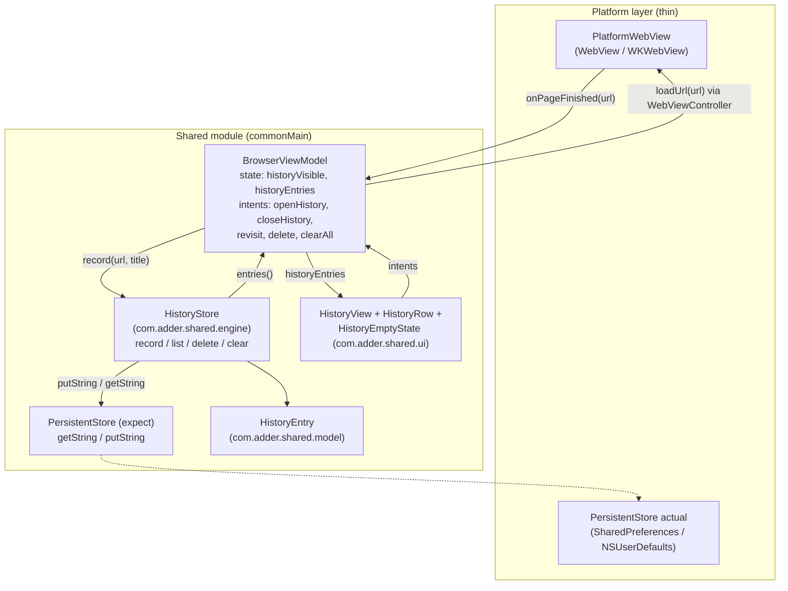
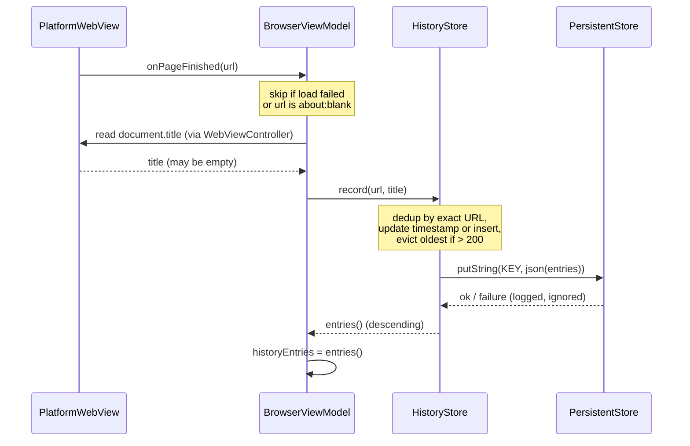

# Design Document: Browsing History

## Overview

This feature adds a persistent browsing history to the Adder browser. Every page that finishes
loading successfully in the built-in WebView is recorded as a `HistoryEntry`. The user can open a
dedicated History view (from the existing hamburger menu, alongside Settings) to see visited pages
in reverse-chronological order, tap an entry to revisit it, delete individual entries, or clear the
whole list. History survives app restarts by persisting to durable device storage.

The design follows the established Adder architecture:

- **All business logic and UI live in the shared KMP module** (`commonMain`); the Android and iOS
  apps stay thin wrappers.
- **A store-like component (`HistoryStore`) in `com.adder.shared.engine`** owns recording, ordering,
  dedup, eviction, and persistence — mirroring the role `SiteWhitelist` plays today.
- **MVVM unidirectional data flow**: `BrowserViewModel` owns observable history UI state
  (`historyVisible`, `historyEntries`) and exposes intents; the WebView reports page-load events via
  the existing callbacks (`onPageFinished`).
- **Cross-session persistence uses an `expect`/`actual` abstraction** (`PersistentStore`) — the same
  pattern used for `LlmClassifier` and `currentModelName()`. Android backs it with
  `SharedPreferences`; iOS backs it with `NSUserDefaults`. The serialized value is a JSON list of
  entries produced by `kotlinx.serialization`.

### Design Goals

- Recording is a side effect of successful navigation, invisible to the user until they open History.
- The store is the single source of truth for history data and its invariants (order, dedup, cap).
- Persistence failures degrade gracefully to in-memory operation — history never crashes the browser.
- UI logic stays in small, previewable composables (list row, empty state), keeping the WebView-hosting
  screen the only non-previewable surface.

### Key Design Decisions

| Decision | Choice | Rationale |
|----------|--------|-----------|
| Where history logic lives | `HistoryStore` in `com.adder.shared.engine` | Matches `SiteWhitelist`; keeps logic testable and platform-agnostic. |
| Persistence abstraction | `expect`/`actual` `PersistentStore` (key/value string) | Matches `LlmClassifier` pattern; SharedPreferences and NSUserDefaults both offer simple string storage sufficient for a 200-entry JSON blob. |
| Serialization | `kotlinx.serialization` JSON of `List<HistoryEntry>` | Project standard; no platform-specific setup. |
| In-memory representation | `ArrayDeque`/`MutableList` in insertion order, sorted for reads | Insertion order gives a deterministic tie-break for equal timestamps; sorting on read keeps writes cheap. |
| Timestamp source | `kotlinx.datetime.Clock.System` (epoch ms) | Already used by `DetectionCache`; consistent time source across the module. |
| When to record | On `onPageFinished`, excluding failed loads and `about:blank` | Matches the "successful load" requirement; the WebView already surfaces this callback. |
| History view presentation | In-app overlay toggled by `historyVisible` state (no Compose Navigation) | Conventions note navigation is intentionally omitted for the single-screen MVP. |

## Architecture

History is a thin new slice layered onto the existing browser architecture. The WebView continues to
report page-load completion to `BrowserViewModel`; the ViewModel forwards successful loads to
`HistoryStore`, which records/orders/dedups/evicts and persists through `PersistentStore`. The
History view reads entries from the ViewModel and dispatches user intents (revisit, delete, clear)
back to it.



### Recording Flow



### Startup / Load Flow

On first construction, `HistoryStore` loads and deserializes the persisted list, sorts it into
descending order, and truncates to the 200 most recent. If the read fails or the payload is corrupt,
it starts from an empty in-memory list without crashing.

## Components and Interfaces

### HistoryStore (`com.adder.shared.engine`)

The single owner of history data and its invariants. Constructed with a `PersistentStore` (defaulted
so callers and previews can omit it). Loads persisted entries eagerly in `init`.

```kotlin
package com.adder.shared.engine

import com.adder.shared.model.HistoryEntry

class HistoryStore(
    private val store: PersistentStore = PersistentStore(),
    private val now: () -> Long = { kotlinx.datetime.Clock.System.now().toEpochMilliseconds() }
) {
    /**
     * Record a successful page load. Excludes about:blank. If [url] exactly matches an
     * existing entry, that entry's timestamp is updated to [timestamp] (no duplicate).
     * Otherwise a new entry is inserted. Evicts the oldest entry when the count would
     * exceed HISTORY_LIMIT. Persists the resulting set. No-op for excluded URLs.
     *
     * @param title page title; blank => URL is used as the display label.
     */
    fun record(url: String, title: String)

    /** All entries ordered by timestamp descending, tie-broken by insertion order (newest first). */
    fun entries(): List<HistoryEntry>

    /** Remove the entry with the given url. No-op if absent. Persists the result. */
    fun delete(url: String)

    /** Remove all entries. Persists the empty set. */
    fun clear()

    companion object {
        const val HISTORY_LIMIT = 200
        const val MAX_TITLE_LENGTH = 512
        internal const val STORAGE_KEY = "adder.browsing_history.v1"
    }
}
```

Internal behavior notes:

- **In-memory model**: a `MutableList<HistoryEntry>` kept in *insertion order* plus a monotonically
  increasing `seq` assigned to each entry on insert/update. Reads (`entries()`) return a copy sorted
  by `(visitTimestamp desc, seq desc)`, which yields the deterministic ordering required by
  Requirement 2.2.
- **Exclusion**: `record` returns immediately for `about:blank` (and any blank URL). Failed loads are
  filtered out upstream in the ViewModel (the WebView does not call `onPageFinished` with a success
  for a failed navigation), so the store only ever sees completed loads.
- **Dedup**: exact string match on `url`. On match, update `visitTimestamp` and bump `seq`; do not
  insert. This satisfies both the general dedup rule (1.6) and the most-recent-entry case (2.3).
- **Title handling**: blank/whitespace title => store `url` as `displayLabel`; otherwise store the
  title truncated to `MAX_TITLE_LENGTH` (512).
- **Eviction**: after an insert, if `size > HISTORY_LIMIT`, remove entries with the smallest
  `(visitTimestamp, seq)` until `size == HISTORY_LIMIT`.
- **Persistence**: every mutating operation serializes the current list to JSON and calls
  `store.putString`. Failures are caught and logged; the in-memory list remains authoritative.

### PersistentStore (`com.adder.shared.engine`) — expect/actual

A minimal key/value string store, following the `LlmClassifier` expect/actual pattern (no-arg
constructor). Only the operations history needs are exposed.

```kotlin
// commonMain
package com.adder.shared.engine

expect class PersistentStore() {
    /** Returns the stored string for [key], or null if absent or on read failure. */
    fun getString(key: String): String?

    /** Persists [value] under [key]. Silently no-ops on failure. */
    fun putString(key: String, value: String)
}
```

```kotlin
// androidMain — backed by SharedPreferences
actual class PersistentStore actual constructor() {
    private val prefs by lazy {
        AppContextHolder.appContext?.getSharedPreferences("adder_prefs", Context.MODE_PRIVATE)
    }
    actual fun getString(key: String): String? =
        runCatching { prefs?.getString(key, null) }.getOrNull()
    actual fun putString(key: String, value: String) {
        runCatching { prefs?.edit()?.putString(key, value)?.apply() }
    }
}
```

```kotlin
// iosMain — backed by NSUserDefaults
actual class PersistentStore actual constructor() {
    private val defaults = NSUserDefaults.standardUserDefaults
    actual fun getString(key: String): String? =
        runCatching { defaults.stringForKey(key) }.getOrNull()
    actual fun putString(key: String, value: String) {
        runCatching { defaults.setObject(value, forKey = key) }
    }
}
```

**Android Context acquisition.** The shared module has no `Context` handle today (ML Kit obtains its
own via an app-startup initializer). We follow the same approach: a shared `AppContextHolder`
object holds the application `Context`, populated by an `androidx.startup.Initializer`
(`AdderContextInitializer`) registered in the shared module's `AndroidManifest.xml`. This keeps the
common API constructor argument-free and matches the existing zero-arg `LlmClassifier()` usage.

### BrowserViewModel additions (`com.adder.shared.ui`)

New observable state and intents, added to the existing `BrowserViewModel`. The store is created once
per ViewModel and loads persisted entries in its `init`.

```kotlin
// New state
var historyVisible by mutableStateOf(false)
    private set
var historyEntries by mutableStateOf<List<HistoryEntry>>(emptyList())
    private set

private val historyStore = HistoryStore()

init {
    historyEntries = historyStore.entries()   // load persisted history on startup (Req 6.2)
}

// New intents
fun openHistory() { historyEntries = historyStore.entries(); historyVisible = true }
fun closeHistory() { historyVisible = false }                       // returns to current page unchanged (Req 3.6)

fun onRevisit(entry: HistoryEntry) {                                // Req 4
    historyVisible = false
    url = entry.url
    inputText = entry.url
    webViewController.loadUrl(entry.url)
}

fun onDeleteHistory(entry: HistoryEntry) {                          // Req 5.1, 5.3, 5.5
    historyStore.delete(entry.url)
    historyEntries = historyStore.entries()
}

fun onClearHistory() {                                              // Req 5.2, 5.4
    historyStore.clear()
    historyEntries = historyStore.entries()
}
```

Recording is wired into the existing `onPageFinished`:

```kotlin
fun onPageFinished(newUrl: String) {
    isLoading = false
    inputText = newUrl
    if (shouldRecord(newUrl)) {                    // excludes about:blank / blank
        val title = webViewController.currentTitle().orEmpty()
        historyStore.record(newUrl, title)
        historyEntries = historyStore.entries()
    }
}
```

`onPageFinished` is only invoked by the WebView on completed loads, so failed loads are naturally
excluded (Req 1.4). Toggling ad blocking reloads the *same* URL, which the store treats as a dedup
update of the most-recent entry rather than a new entry (Req 6.4). A `currentTitle()` accessor is
added to `WebViewController` (returns the live WebView's `document.title` / `WKWebView.title`).

### WebViewController addition (`com.adder.shared.ui`)

```kotlin
internal var onCurrentTitle: (() -> String?)? = null
fun currentTitle(): String? = onCurrentTitle?.invoke()
```

Each platform WebView registers `onCurrentTitle` on creation (Android: `view.title`; iOS:
`wkWebView.title`).

### History UI (`com.adder.shared.ui`)

A `HistoryView` composable, shown as a full-screen overlay while `historyVisible` is true (rendered
by `BrowserScreen` above the WebView area). It delegates to two small, previewable composables:

- `HistoryRow(entry, onClick, onDelete)` — renders `entry.displayLabel` (primary) and `entry.url`
  (secondary), with a trailing delete icon.
- `HistoryEmptyState()` — the "no history recorded" message.

```kotlin
@Composable
fun HistoryView(
    entries: List<HistoryEntry>,
    onEntryClick: (HistoryEntry) -> Unit,
    onEntryDelete: (HistoryEntry) -> Unit,
    onClearAll: () -> Unit,
    onClose: () -> Unit,
    modifier: Modifier = Modifier
)
```

`HistoryView` shows a top bar (title, close, clear-all action), then either `HistoryEmptyState` (when
`entries` is empty) or a `LazyColumn` of `HistoryRow`s. The existing `AppMenu` in `BrowserScreen`
gets a new "History" `DropdownMenuItem` next to "Settings" that calls `viewModel.openHistory()`.
`HistoryRow` and `HistoryEmptyState` are previewable (fake data, wrapped in `MaterialTheme`);
`HistoryView` itself is previewable too since it takes plain data. `BrowserScreen`/`App` remain the
only non-previewable surfaces because they host the WebView.

## Data Models

### HistoryEntry (`com.adder.shared.model`)

```kotlin
package com.adder.shared.model

import kotlinx.serialization.Serializable

/**
 * A single recorded page visit.
 */
@Serializable
data class HistoryEntry(
    /** The full page URL. Serves as the identity for dedup (exact string match). */
    val url: String,
    /** Display label: the page title (truncated to 512 chars) or the URL if no title. */
    val displayLabel: String,
    /** Visit time in epoch milliseconds; drives descending ordering. */
    val visitTimestamp: Long
)
```

Notes:

- `displayLabel` is resolved at record time (title-or-URL, truncated) so the view never needs
  fallback logic; Requirement 3.3 is satisfied by construction.
- The `seq`/insertion-order tie-break is an in-memory concern of `HistoryStore` and is intentionally
  *not* part of the serialized model. On load, entries are read back in their stored list order,
  which preserves relative order for equal timestamps; the store reassigns `seq` by load position.
- The persisted payload is `Json.encodeToString(ListSerializer(HistoryEntry.serializer()), entries)`
  stored under `STORAGE_KEY`.


## Correctness Properties

*A property is a characteristic or behavior that should hold true across all valid executions of a
system — essentially, a formal statement about what the system should do. Properties serve as the
bridge between human-readable specifications and machine-verifiable correctness guarantees.*

The properties below target `HistoryStore` (pure, in-memory logic with a pluggable `PersistentStore`)
and the `BrowserViewModel` history intents (with a fake `WebViewController`). They were derived from
the acceptance criteria and consolidated during prework to remove redundancy (e.g. the several
dedup, cap, and display-label criteria each collapse into a single comprehensive property).

### Property 1: History is ordered by recency

*For any* sequence of recorded visits, the entries returned by `HistoryStore.entries()` are ordered
by `visitTimestamp` descending; when two entries share an equal `visitTimestamp`, the more recently
inserted (or updated) entry appears first, and repeated calls return the same order.

**Validates: Requirements 2.1, 2.2**

### Property 2: Recording a distinct valid URL inserts one entry

*For any* history store and any valid URL (non-blank, not `about:blank`) that is not already present,
recording it with a given timestamp increases the entry count by exactly one and produces an entry
whose `url` equals the recorded URL and whose `visitTimestamp` equals the given timestamp.

**Validates: Requirements 1.1, 2.4**

### Property 3: Exact-URL dedup updates the timestamp without duplicating

*For any* history store containing an entry with URL `U`, recording `U` again with a new timestamp
leaves the total entry count unchanged and sets that entry's `visitTimestamp` to the new timestamp
(covering both the general duplicate case and the reload-after-toggle case for the most-recent entry).

**Validates: Requirements 1.6, 2.3, 6.4**

### Property 4: Display label is the truncated title or the URL

*For any* recorded visit, the resulting entry's `displayLabel` equals the reported title truncated to
512 characters when the title is non-blank, and equals the URL when the title is blank or whitespace.

**Validates: Requirements 1.2, 1.3, 3.3**

### Property 5: The store never exceeds the 200-entry limit

*For any* sequence of recorded visits, both the in-memory entry count and the persisted entry count
are at most 200; whenever recording would exceed 200, the entries with the smallest `visitTimestamp`
(oldest first) are removed until exactly 200 remain.

**Validates: Requirements 1.7, 2.5, 3.5, 6.5**

### Property 6: Excluded URLs are never recorded

*For any* history store, recording an `about:blank` (or otherwise blank) URL leaves the entry set
completely unchanged.

**Validates: Requirements 1.5**

### Property 7: Revisiting an entry loads it, closes history, and updates the address bar

*For any* history entry, invoking the revisit intent issues a load of that entry's URL through the
WebView controller, sets `historyVisible` to false, and sets the address-bar URL to the entry's URL.

**Validates: Requirements 4.1, 4.2, 4.3**

### Property 8: Deleting an entry removes only that entry and persists the removal

*For any* history store and any URL it contains, deleting that URL removes exactly that entry, retains
all other entries in order, and a store reloaded from the same backing storage no longer contains the
deleted URL.

**Validates: Requirements 5.1, 5.3**

### Property 9: Deleting an absent entry is a no-op

*For any* history store and any URL it does not contain, deleting that URL leaves both the in-memory
entry set and the persisted payload unchanged.

**Validates: Requirements 5.5**

### Property 10: Clearing removes all entries and persists the empty state

*For any* history store, clearing yields an empty entry set, and a store reloaded from the same
backing storage is also empty.

**Validates: Requirements 5.2**

### Property 11: Persistence round-trip preserves the ordered set

*For any* sequence of record/delete/clear operations, constructing a new `HistoryStore` over the same
`PersistentStore` yields an `entries()` result equal (same URLs, labels, timestamps, and descending
order) to the original store's `entries()`.

**Validates: Requirements 6.1, 6.2**

### Property 12: Storage failures degrade gracefully

*For any* sequence of operations performed against a `PersistentStore` that fails on every read and
write, `record`, `delete`, `clear`, and `entries` never throw, and the in-memory results still satisfy
the ordering, dedup, and 200-cap invariants for the session.

**Validates: Requirements 6.6**

## Error Handling

| Condition | Handling |
|-----------|----------|
| `PersistentStore` read fails / returns corrupt JSON on load (Req 6.6) | `HistoryStore.init` wraps the read + `Json.decodeFromString` in `runCatching`; on failure it starts with an empty in-memory list. No exception propagates. |
| `PersistentStore` write fails during a mutation (Req 6.6) | `putString` catches internally and the store ignores the failure; the in-memory list remains the source of truth for the session. |
| Android application `Context` unavailable (initializer not yet run) | `PersistentStore` (Android) treats a null `Context`/prefs as unavailable storage — reads return null, writes no-op — degrading to in-memory, same as a read/write failure. |
| Blank or `about:blank` URL passed to `record` (Req 1.5) | Early return; entry set unchanged. |
| Title is null/blank (Req 1.3) | `displayLabel` falls back to the URL. |
| Title longer than 512 chars (Req 1.2) | Truncated to 512 before storing. |
| Revisited URL fails to load (Req 4.4) | Load failure is surfaced by the WebView's existing error path (address-bar shows the failed URL); the entry is retained because revisit never deletes. |
| `delete` for an absent URL (Req 5.5) | No-op: neither the in-memory list nor the persisted payload changes. |
| Page load fails before completion (Req 1.4) | `onPageFinished` is not invoked for failed navigations, so `record` is never called; previously recorded entries are untouched. |

All persistence access is funneled through `runCatching`, so a misbehaving platform store can never
crash the browser — the worst case is that history is not durable for that session.

## Testing Strategy

### Dual Approach

- **Property-based tests** verify the universal invariants of `HistoryStore` and the history intents
  across many generated inputs (ordering, dedup, cap, persistence round-trip, graceful degradation).
- **Example-based unit tests** cover concrete UI-state transitions and behavioral guarantees that are
  not universally quantified (empty-state display, close-without-reload, revisit-does-not-delete).
- **Compose previews** stand in for visual verification of the previewable composables.

Because these are pure Kotlin components in `commonMain`, tests live in `commonTest` and run on the
JVM without a device or WebView.

### Property-Based Testing

PBT is appropriate here: `HistoryStore` is essentially a pure data structure (record/order/dedup/evict)
with an injectable `PersistentStore`, and there are strong universal invariants over a large input
space (arbitrary URLs, titles, timestamps, and operation sequences).

- **Library**: `io.kotest:kotest-property` (Kotest Property) for `commonTest`. It is the standard
  KMP-friendly property-testing library; do not hand-roll generators or a PBT harness.
- **Iterations**: configure each property test to run a minimum of **100 iterations**
  (`PropTestConfig(iterations = 100)`).
- **Generators**:
  - URLs: `Arb.of(...)` over a small pool mixed with `Arb.string()` to force both collisions
    (exercising dedup) and distinct values (exercising insert/cap), plus explicit `about:blank`.
  - Titles: `Arb.string(0..1000)` including blank/whitespace and strings longer than 512.
  - Timestamps: `Arb.long(...)` including repeated values to exercise the equal-timestamp tie-break.
  - Operation sequences: `Arb.list(Arb.choice(record, delete, clear))` for round-trip/degradation.
  - A `FakePersistentStore` (in-memory map) and a `FailingPersistentStore` (throws on every call) back
    the persistence and graceful-degradation properties. A fake `WebViewController` records
    `loadUrl` calls for the revisit property.
- **Tagging**: each property test is tagged with a comment referencing its design property, using the
  format **Feature: browsing-history, Property {number}: {property text}**. Each of the 12
  correctness properties is implemented by a **single** property-based test.

Example mapping of properties to tests:

| Property | Test focus |
|----------|-----------|
| 1 | `entries()` is non-increasing by timestamp; equal timestamps ordered by insertion; stable across calls |
| 2 | distinct valid URL grows count by one with matching url/timestamp |
| 3 | re-recording an existing URL keeps count, updates timestamp |
| 4 | `displayLabel` == `title.take(512)` when non-blank else `url` |
| 5 | in-memory and persisted counts <= 200; oldest evicted |
| 6 | recording `about:blank` leaves entries unchanged |
| 7 | revisit loads url, sets `historyVisible=false`, updates `url`/`inputText` |
| 8 | delete removes only target; reload lacks it |
| 9 | delete of absent url changes nothing (memory + persisted) |
| 10 | clear empties memory and persisted |
| 11 | reload over same store equals original `entries()` |
| 12 | failing store never throws; invariants still hold |

### Example-Based Unit Tests

- Empty history: `HistoryStore.entries()` is empty on a fresh store with empty storage (Req 3.4/5.4).
- Close without reload: `openHistory()` then `closeHistory()` leaves `url` unchanged and issues no
  `loadUrl` (Req 3.6).
- Revisit retains entry: after `onRevisit(entry)`, the store still contains `entry.url` (Req 4.4).
- Recording trigger: `onPageFinished` on a successful load records; a failed load (no `onPageFinished`)
  does not (Req 1.4). ViewModel refreshes `historyEntries` after record/delete/clear (Req 5.3).
- Cross-navigation accumulation: multiple `record` calls on the same store instance accumulate up to
  the cap (Req 6.3).

### Compose Previews (UI verification)

Per project conventions, every previewable composable has at least one `@Preview` (multiplatform
annotation, `private`, wrapped in `MaterialTheme`, fake data):

- `HistoryRow` — one with a title label, one with a URL-only label (long URL) to check truncation/wrap.
- `HistoryEmptyState` — the no-history message.
- `HistoryView` — a populated-list state and an empty state.

`BrowserScreen`/`App`/`PlatformWebView` remain exempt from previews because they host the live WebView.

### Manual Verification

Consistent with the project's device-first MVP validation: on real Android and iOS devices, visit
several pages, confirm they appear newest-first in History, revisit one, delete one, clear all, then
relaunch the app and confirm the persisted history (and cleared state) is restored correctly.
